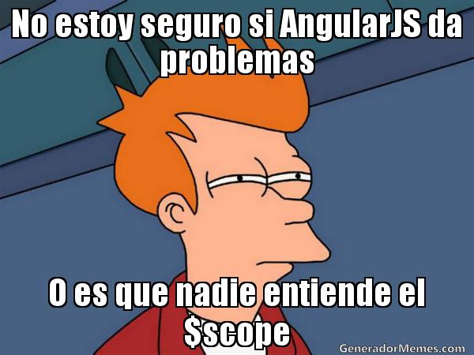
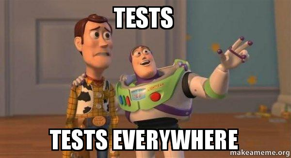

In my first blog post, I'm trying to recap about the people and actions
that have taken me to where I am now.

> After start, I want to thank my wife, [Verónica González](https://www.instagram.com/corazonderisa/),
> who encouraged me to start studying again, and without who I'm sure that never
> would have taken the right decisions that I think that I took.

To give a little of context about my background, I studied DAM (Multiplatform
Application Development), where I learned Java, a little bit of Python and
DataBases managament. Now we can start! 

And before start to recap, I want to also thank
[Quim Granados](https://www.linkedin.com/in/quimgranados/),
[Vanessa Palmer](https://www.linkedin.com/in/palmervanessa/) and
[Igor Modino](https://www.linkedin.com/in/igor-modino-p%C3%A9rez-83426539/),
who trust on me during my internship at [eSportics](https://www.esportics.com/es/),
and where I began to learn what to be a frontend means, after develop with Java
executed 99% of the time from the command line.

I discovered WTF is a CSS file, and how it is related with the HTML elements,
and of course, jQuery, with the DOM interaction, Ajax and the async
requests and callback functions... At that moment, I had no idea about what I
was doing, but I got out of the databases, except for some PHP stuff, and I
began to learn how to build and interact with a flexible and nice UI, and
I began to enjoy as a child do.

After end my internship and my studies, I started to look for a developer job at...
InfoJobs. It was a wrong decision. I only found underpaid and unattractive job positions.
Then, I continue working at warehouse as I never studied anything, but playing with
[Laravel](https://laravel.com/) and [Angular](https://angular.io/), also taking a very
helpful at the beginning online courses at [Patzi](https://platzi.com/).

But everything changed in april 2016, when a friend and fellow student, 
[Biel Conde](https://www.linkedin.com/in/biel-conde-manyoses-45131286/),
who was working as frontend team lead, decided to call me to a job interview
where needed skills were... PHP and Angular.

> Oh I know how to manage this kind of applications!

Spoiler, **real world is not that easy**, we had an underperformant app with
a lot of bugs and bad practises, where we need to put order and new features at same time. Here
I learned what a professional frontend developer must do.

We really worked a lot to accomplish it, but two months later, the company decided to start the
project again from the roots with a new approach, without using (magic) frameworks where
the developers can easily lose the control about its happening.

At this moment, another fundamental factor appears. The company hired
[Germán Robledo](https://www.linkedin.com/in/germanrcuriel/), and we began creating a
[Backbone](https://backbonejs.org/) + [Marionette](https://marionettejs.com/) application,
using a less magic framework than the old Angular 1.5, where I learned a lot about JS listeners
and how to manage it in a way that don't compromise the app performance, how JS (and general,
but specially in JS) loops can slow down the app when we were working with a lot of data that 
finally prints a screen with a lot of graphics...

I remember with special love this time period, I remember that, as a super junior developer,
see and contribute into how a new application was born, gives me an especial relation with the project.
In a few time, I can code alone without any problem, of course I'd got a lot a PR comments to improve
the code, but it was crucial to began to refine my **code quality**, thinking that the code must
do only what it supose to do, must be self-explanatory, understandable, and readable by other people.

But Germán leaves the company in may 2017, and start working at my actual company, as frontend team lead
(of himself). And a **week ago**...

> Hi Carlos! Do you remember me from last week that we were working together?  
> I'm creating a team!

I accepted the proposal, and we hired Biel again, that was working in his own company, but wants to
change his work place.

Here, we met [Gloria Hornero](https://www.linkedin.com/in/gloriahornero/), from whom
I learned a lot about testing (and **Ruby** as a gift that I'd used after to build into a
[Middleman](https://middlemanapp.com/) project), but I consider testing to be my weak point yet today,
not implement the tests, but know what should be tested.

After German leaves the company and Biel began as a team lead, we started seriously doing
[VueJS](https://vuejs.org/) things, what we were playing but not using in production. We created a
Vue components library and started creating Vue projects to standarize it as a frontend, very
chaotic at the beginning, but a very nice project step by step.
